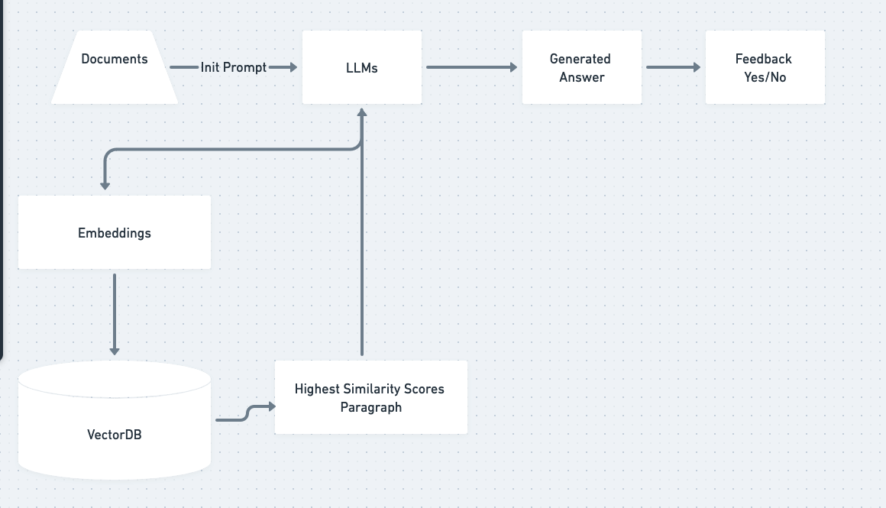

## Retrieval-augmented generation ( RAG ) 

### Requirments:

1. User will upload a file, current support only .txt file.
2. A local LLM or API will be used to find embeddings and store in VectorDB.
3. A search bar will be available which lets users search document, ask questions and even chat.

### Todo

- [x] System Design of how data will flow.
- [x] Use Gutenberg Project book and cleanup for demo
- [x] buy openai credits for MVP
- [x] Find right VectorDB, settled with Qdrant
- [ ] Use simple text file with content for v1

### Learning Goals

- Checkout VectorDBs and how it works.
- Embeddings from LLM extraction
- search and doing similarity search
- Frontend for search experience + chatbot design.

### System Design
